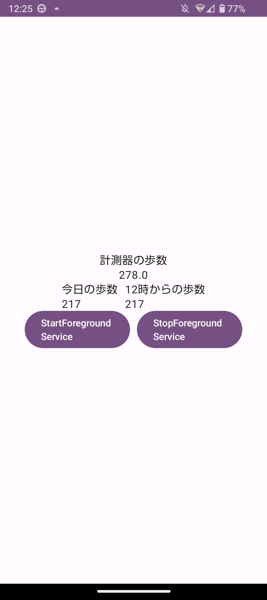
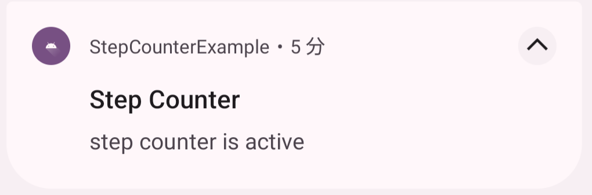

# android-compose-step-counter-example
歩数計の最低限の実装を行ったアプリ。

## 想定環境
使用言語: Kotlin  
Android Studio Hedgehog | 2023.1.1  
OS: Windows 11  
minSdkVersion: 26  
targetSdkVersion: 34  

## アプリのメイン画面
<p align="center">
  
</p>
<p align="center">
  図1. アプリのメイン画面
</p>

## 利用手順
「StartForegroundService」ボタンをタップします。そうすると、図2の通知が表示されます。この通知が表示されている間は歩数計測を行っています。歩数計測を止めたい場合は「StopForegroundService」ボタンをタップします。そうすると、図2の通知が削除されます。それと同時に歩数計測が停止されます。

<p align="center">
  
</p>
<p align="center">
  図2. 通知
</p>

## 注意すること
ForegroundServiceを伴う通知のため、アプリを終了しても通知は表示され続けます。そのため、通知を閉じたい場合はアプリのボタンを押すことで通知を閉じるようにします。

## 使用ライブラリ
### Hilt
build.gradle.kts(Project)
```
plugins {
    id("com.google.dagger.hilt.android") version "2.48.1" apply false
}
```
build.gradle.kts(Module)
```
plugins {
    kotlin("kapt")
    id("com.google.dagger.hilt.android")
}

dependencies {
    implementation("com.google.dagger:hilt-android:2.48.1")
    kapt("com.google.dagger:hilt-android-compiler:2.48.1")
}

kapt {
    correctErrorTypes = true
}
```
### Room
build.gradle.kts(Project)
```
plugins {
    id("com.google.devtools.ksp") version "1.9.0-1.0.13" apply false
}
```
build.gradle.kts(Module)
```
plugins {
    id("com.google.devtools.ksp")
}

dependencies {
    val roomVersion = "2.6.1"
    implementation("androidx.room:room-runtime:$roomVersion")
    annotationProcessor("androidx.room:room-compiler:$roomVersion")

    ksp("androidx.room:room-compiler:$roomVersion")

    implementation("androidx.room:room-ktx:$roomVersion")
}
```
### ViewModel
build.gradle.kts(Module)
```
dependencies {
    implementation("androidx.lifecycle:lifecycle-viewmodel-compose:2.6.2")
    implementation("androidx.lifecycle:lifecycle-viewmodel-ktx:2.6.2")
}
```
## 使用権限
ForegroundService関連
```xml
<uses-permission android:name="android.permission.POST_NOTIFICATIONS"/>
<uses-permission android:name="android.permission.FOREGROUND_SERVICE"/>
```
センサ関連
```xml
<uses-permission android:name="android.permission.ACTIVITY_RECOGNITION"/>
```
